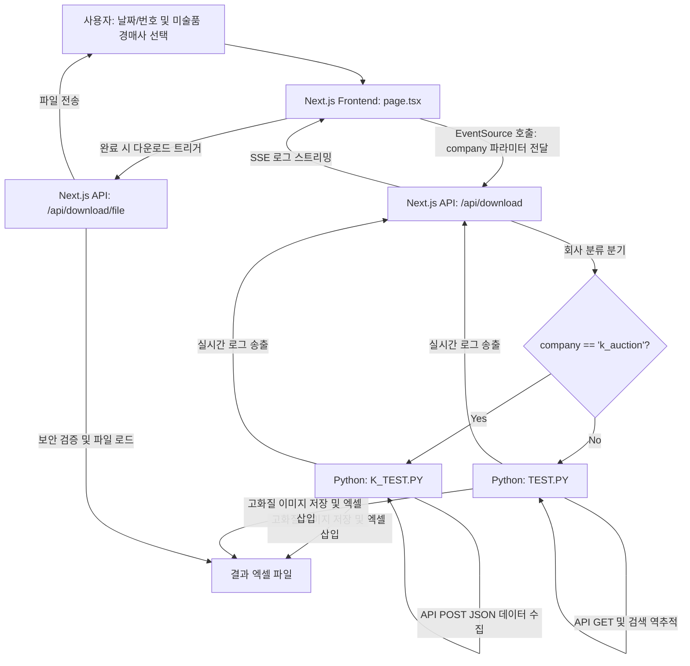

# Next.js 기반 경매결과 다운로더 웹 앱 (서울옥션 & 케이옥션 통합) 완료 보고서

사용자가 서울옥션 혹은 케이옥션을 선택하여 날짜 또는 경매 ID를 기입하면 파이썬 백엔드 스크립트(`TEST.PY` 혹은 `K_TEST.PY`)를 실시간 구동하여 로그를 스트리밍하고, 이미지가 삽입된 프리미엄 엑셀 파일을 자동 다운로드해 주는 웹 크롤러 다운로더 시스템 통합 구축을 완료했습니다.

---

## 1. 시스템 아키텍처



- **다양한 API 규격 대응:** 
  - **서울옥션:** 날짜 정보로부터 실제 경매 ID(`SALE_NO`)를 역추적하는 GET 요청 기반 로직을 실행합니다.
  - **케이옥션:** 사용자 입력 경매 ID(`auc_num`)로 <h1> 태그 타이틀을 크롤링하고 POST JSON API `/api/Auction/1/{auc_num}`를 다이렉트로 호출합니다.
- **실시간 프로그레스 스트리밍 (SSE):** 
  - `Server-Sent Events` 기술을 채택하여 파이썬 프로세스가 출력하는 표준 출력을 실시간 캡처하여 프론트엔드로 보내줍니다.

---

## 2. 웹 앱 UI 디자인 및 서식
- **디자인 테마:** 럭셔리 다크 글래스모피즘 테마.
- **미술품 경매사 선택 탭:** 상단에 "서울옥션 (Seoul)" 및 "케이옥션 (K-Auction)"의 회사 선택 탭을 구현했습니다.
  - 서울옥션 선택 시: 연도 필터 드롭다운과 날짜 입력 칸이 활성화됩니다.
  - 케이옥션 선택 시: 연도 필터가 숨겨지고 다이렉트 경매 번호 입력 필드로 UI가 간결하게 맞춤 전환됩니다. (케이옥션 브랜드 컬러인 다크레드 계열의 포인트 버튼과 오렌지 글로우 그림자가 적용됩니다.)
- **상태 카드 모니터링:** 5개의 주요 작업 단계가 진행에 맞게 실시간 체크 및 활성화 서식으로 자동 변경됩니다.

---

## 3. 웹 앱 작동 검증 시연 비디오 (WebP)

````carousel

<!-- slide -->

````

---

## 4. 구동 방식 및 빌드 가이드
로컬 개발 환경에서 이 웹 앱을 실행하려면 `web` 폴더 내에서 다음 명령어를 실행하면 됩니다:
```bash
# 개발 서버 실행 (기본 포트: 3000)
npm run dev
```
이후 브라우저에서 `http://localhost:3000`에 접속하여 사용합니다.
